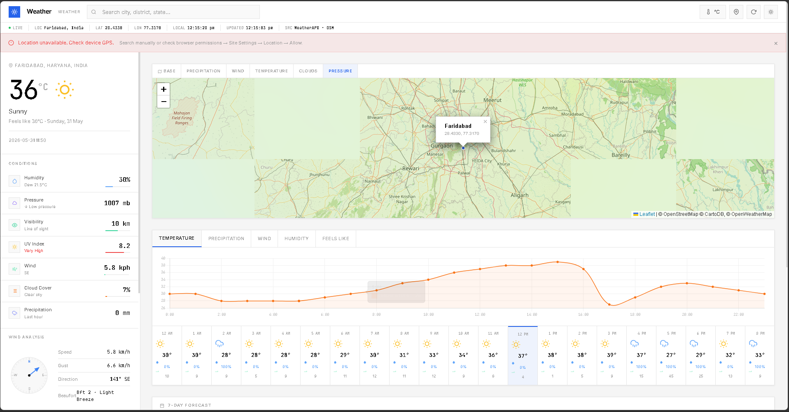

# Weather Systems

A weather intelligence platform built using vanilla web technologies and real-world APIs. Weather demonstrates advanced frontend engineering concepts including API integration, geospatial visualization, canvas rendering, responsive UI architecture, and data-driven user experiences.

---

## Overview

Weather provides comprehensive weather insights through an intuitive dashboard interface that combines real-time weather data, air quality monitoring, interactive maps, astronomical information, weather alerts, and news updates.

The application is designed to showcase modern browser capabilities without relying on frontend frameworks, highlighting strong proficiency in JavaScript, browser APIs, UI architecture, and performance optimization.

---

## Preview
Live Demo: [https://gestureresearchdatabase.web.app](https://gestureresearchdatabase.web.app)



---

## Features

### Location Intelligence

* Browser-based GPS location detection
* Automatic fallback to IP geolocation when GPS access is unavailable
* India-focused city search with instant autocomplete suggestions
* OpenStreetMap Nominatim geocoding integration
* Keyboard-accessible search experience

### Weather Analytics

* Current weather conditions
* Temperature and "feels like" readings
* Humidity, pressure, visibility, UV index, and cloud cover
* Precipitation monitoring
* Dew point calculation
* Beaufort wind scale classification
* Interactive wind compass with directional bearing visualization

### Forecasting

#### Hourly Forecast

* 24-hour forecast visualization
* Interactive chart views for:

  * Temperature
  * Precipitation
  * Wind Speed
  * Humidity
  * Feels Like Temperature

#### Daily Forecast

* Seven-day forecast overview
* Daily high and low temperatures
* Animated temperature range indicators

### Air Quality Monitoring

* PM2.5
* PM10
* O₃ (Ozone)
* NO₂ (Nitrogen Dioxide)
* SO₂ (Sulfur Dioxide)
* CO (Carbon Monoxide)

Additional capabilities:

* US EPA AQI standard
* UK DAQI standard
* Health impact classification
* Contextual safety recommendations

### Astronomy

* Sunrise and sunset tracking
* Live solar arc visualization
* Moon phase information
* Illumination percentage
* Moonrise and moonset data

### Interactive Weather Maps

Built using Leaflet with multiple overlay layers:

* Precipitation Radar
* Wind Speed
* Temperature
* Cloud Coverage
* Atmospheric Pressure

Features include:

* Dynamic map themes
* Custom location markers
* Detailed location popups

### Weather Alerts

* Real-time weather warnings
* Severity classification:

  * Extreme
  * Severe
  * Moderate
  * Minor
* Alert descriptions and validity periods

### News Integration

* Live India news headlines
* Responsive card-based layout
* Source attribution
* Author information
* Relative publication timestamps
* Thumbnail support

### Theme System

* Light mode
* Dark mode
* Theme persistence via localStorage
* Automatic canvas redraws on theme changes

### Performance Optimizations

* Framework-free implementation
* Debounced search requests
* Lazy-loaded news images
* Efficient chart lifecycle management
* Memory leak prevention through chart destruction and recreation

---

## Technology Stack

| Category      | Technology                  |
| ------------- | --------------------------- |
| Markup        | HTML5                       |
| Styling       | CSS3, Tailwind CSS          |
| Logic         | Vanilla JavaScript (ES2022) |
| Charts        | Chart.js v4                 |
| Maps          | Leaflet.js v1.9             |
| Map Tiles     | CartoDB, OpenStreetMap      |
| Weather Radar | RainViewer, OpenWeatherMap  |
| Geocoding     | OpenStreetMap Nominatim     |
| Weather Data  | WeatherAPI.com              |
| News Data     | NewsAPI.org                 |
| Geolocation   | Browser GPS API, ipapi.co   |
| Typography    | Inter, JetBrains Mono       |

---

## Project Structure

```text
web-development/
│
├── Pages/
│   ├── index.html
│   │
│   ├── css/
│   │   └── styles.css
│   │
│   └── js/
│       └── app.js
│
├── preview.png
└── README.md
```

---

## Getting Started

### Clone the Repository

```bash
git clone https://github.com/your-username/web-development.git
cd web-development
```

### Run Locally

#### Option 1: Open Directly

```bash
cd Pages
open index.html
```

#### Option 2: Live Server (Recommended)

Using VS Code Live Server:

```text
Right-click index.html → Open with Live Server
```

Using Node.js:

```bash
npx serve Pages/
```

> Note: Browser geolocation requires a secure context (`https://` or `localhost`).

---

## API Requirements

| Service        | Purpose                      | Free Tier          |
| -------------- | ---------------------------- | ------------------ |
| WeatherAPI.com | Weather, Air Quality, Alerts | 1M requests/month  |
| NewsAPI.org    | News Headlines               | 100 requests/day   |
| OpenWeatherMap | Weather Layer Tiles          | 1,000 requests/day |

### Security Considerations

This project stores API keys in the client for demonstration purposes.

For production deployments:

* Move API keys to a secure backend
* Proxy third-party API requests
* Use server-side authentication
* Implement rate limiting and request validation

Recommended backend options:

* Node.js
* Next.js API Routes
* Cloudflare Workers
* Serverless Functions

---

## Browser Support

| Browser       | Support   |
| ------------- | --------- |
| Chrome 90+    | Supported |
| Firefox 88+   | Supported |
| Safari 14+    | Supported |
| Edge 90+      | Supported |
| Mobile Chrome | Supported |
| Mobile Safari | Supported |

---

## Architecture Decisions

### Why Vanilla JavaScript?

The application is intentionally built without frontend frameworks to demonstrate a strong understanding of:

* Browser APIs
* DOM manipulation
* State management
* Event systems
* Performance optimization

### Why CSS Custom Properties?

CSS variables allow runtime theme switching without recompilation and provide a framework-agnostic theming system that remains maintainable and scalable.

### Why Canvas for Visualizations?

Canvas provides low-level rendering control and better support for dynamic calculations used in:

* Wind direction visualization
* Solar path rendering
* Real-time redraw operations

### Why Leaflet?

Leaflet offers:

* Lightweight footprint
* Open-source flexibility
* Provider-agnostic map tiles
* No dependency on proprietary mapping platforms

Its ecosystem integrates seamlessly with weather overlays and custom tile providers.

---

## Roadmap

* Progressive Web App (PWA) support
* Offline caching with Service Workers
* Push notifications for severe weather alerts
* Multi-location comparison dashboards
* Historical weather analytics
* Secure backend API proxy
* Automated testing with Jest

---

## License

MIT License

Copyright (c) 2024

Permission is hereby granted, free of charge, to any person obtaining a copy of this software and associated documentation files to deal in the Software without restriction, including without limitation the rights to use, copy, modify, merge, publish, distribute, sublicense, and/or sell copies of the Software.

---

## Acknowledgements

* WeatherAPI.com
* OpenStreetMap
* CartoDB
* RainViewer
* Chart.js
* Leaflet.js
* Lucide

---

Built to demonstrate modern frontend engineering practices, real-time data integration, geospatial visualization, and responsive application architecture.
